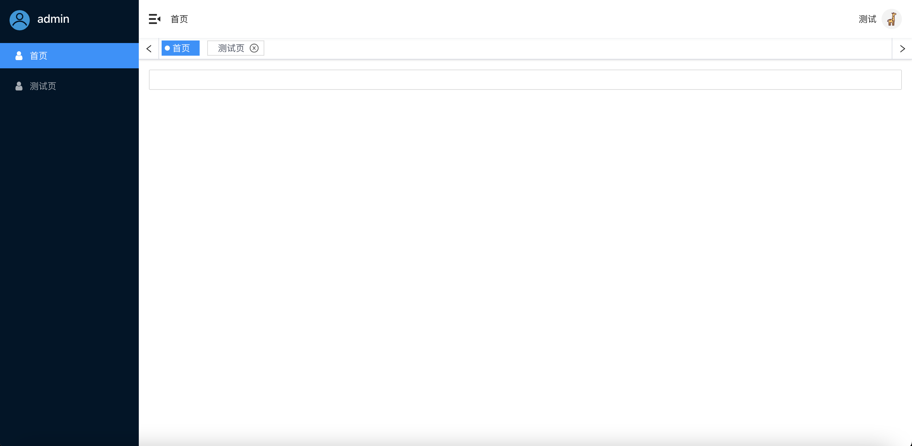
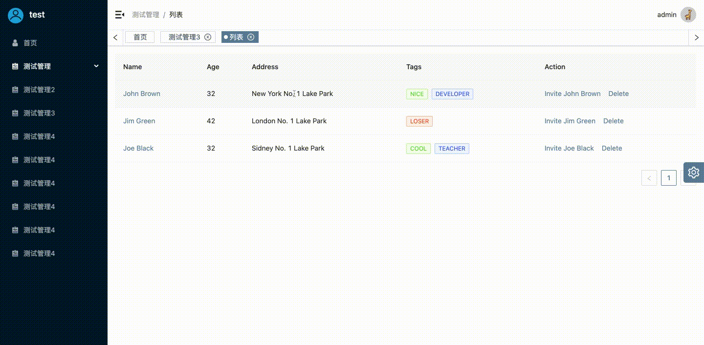

# little-deer-ui

## 使用

```sh
npm install little-deer-ui
or
yarn add little-deer-ui
```

## 按需加载组件配置

### 在 create-react-app 中使用

```sh
yarn add react-app-rewired customize-cra
```

```json
/* package.json */
"scripts": {
-   "start": "react-scripts start",
+   "start": "react-app-rewired start",
-   "build": "react-scripts build",
+   "build": "react-app-rewired build",
-   "test": "react-scripts test",
+   "test": "react-app-rewired test",
}
```

然后在项目根目录创建一个 `config-overrides.js` 用于修改默认配置

```javascript
module.exports = function override(config, env) {
  // do stuff with the webpack config...
  return config;
};
```

### 使用 babel-plugin-import

```shell
 yarn add babel-plugin-import
```

```javascript
+ const { override, fixBabelImports } = require('customize-cra');

- module.exports = function override(config, env) {
-   // do stuff with the webpack config...
-   return config;
- };
+ module.exports = override(
+   fixBabelImports('import', {
+     libraryName: 'little-deer-ui',
+     libraryDirectory: 'dist/lib',
+     camel2DashComponentName: false
+   },'little-deer-ui'),
+ );
```
### 引入Layout使用

安装history

```shell
npm add history@4.10.0
or 
yarn add history@4.10.0
```
```jsx
import {Layout} from 'little-deer-ui'
import {createHashHistory} from 'history'
const routeItems = [
  {
    path: '/home',
    exact: true,
    meta: {
      tabFixed: true,
      isCache: true,
      icon: () => <Icon type='iconuser' />,
      name: '首页',
    },
    component: () => <div>home</div>,
  },
  {
    path: '/test',
    exact: true,
    meta: {
      isCache: true,
      icon: 'iconuser',
      name: '测试页',
    },
    component: () => <div>test</div>,
  },
]
const App = () => (
  <Layout
    proName={'admin'}
    routeItems={routeItems}
    history={createHashHistory()}
    username={'测试'}
    onClickDrop={() => {console.log('23')}}
  >
    {renderRoutes()}
  </Layout>
)
```
```less
html, body {
	margin: 0;
	padding: 0;
	height: 100%;
}
#root {
	height: 100%;
}
```

### layout路由缓存
```shell
yarn add react-router-cache-route
or
npm install react-router-cache-route
```
```tsx
import {CacheRoute, CacheSwitch, refreshByCacheKey, dropByCacheKey} from 'react-router-cache-route'

const aliveControl = {
   dropByCacheKey,
   refreshByCacheKey
}

const Routes = () => {
  const renderRoutes = () => {
    let routes = []
    const routeMap = (arr) => {
      arr.forEach(route => {
        if (!route.meta.hidden) {
          routes.push(
            <CacheRoute  // 替换Route => CacheRoute
              when={() => !!route.meta.isCache} // 是否缓存
              cacheKey={route.path} // 缓存key
              key={route.path}
              exact={route.exact}
              path={route.path}
              component={route.component}
            />,
          )
        }
        if (route.routes && route.routes.length) routeMap(route.routes)
      })
    }
    routeMap(routeItems)
    return routes
  }
  return (
    <Router history={myHistory}>
      <CacheSwitch aliveControl={aliveControl}> // 替换 Switch => CacheSwitch, 添加aliveControl
        ...
      </CacheSwitch>
    </Router>
  )
}
```

### 刷新清除刷新
如使用路由缓存功能，tab即开启刷新功能。


### 清除tab记录浏览器缓存
```ts
import {Layout} from 'little-deer-ui'
const clearTabs = () => {
  Layout.Tabs.clearTabsCache()
}
```

[组件库预览地址](https://g_guojq.gitee.io/little-deer-ui)
[实战项目源码地址](https://gitee.com/g_guojq/react-antd-admin)


